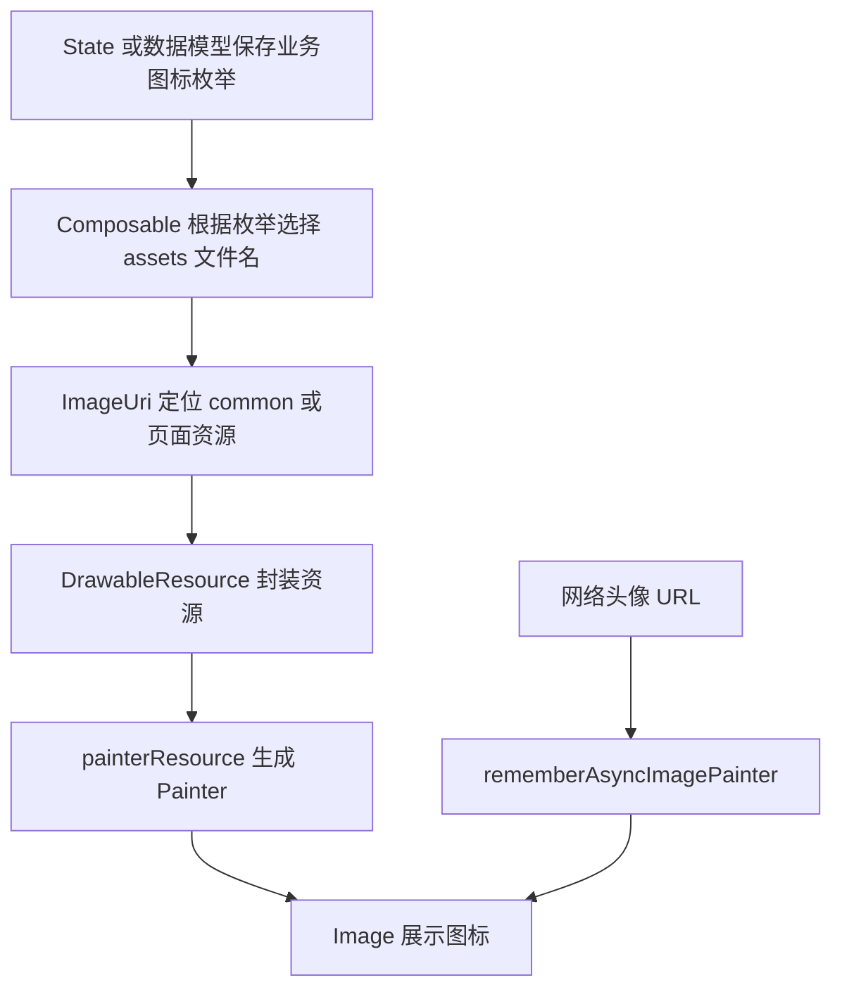

# Kuikly 中 ImageVector 的替代方案

## 原始问题

Kuikly 中没有 `ImageVector` 类型，原 Android Compose 代码使用了 `Icons.Default.*` 和 `Icon(imageVector = ...)`，应该使用什么方式代替？

## 核心结论

Kuikly Compose 不提供 Android Compose 的 `ImageVector` 和 `Icons.Default.*`。通常应使用 **图片资源 + `Painter` + `Image`** 替代：

- 页面状态或数据模型保存业务枚举、资源名称等与 UI 框架无关的数据；
- Composable 根据枚举或名称取得 `DrawableResource`；
- 使用 `painterResource()` 转换成 `Painter`；
- 最终用 `Image()` 展示；
- 网络头像等动态图片使用 `rememberAsyncImagePainter()`；
- 不建议在 State 或普通数据模型中保存 `Painter`。

## 类型对应关系

| Android Compose | Kuikly Compose 推荐方式 |
|---|---|
| `ImageVector` | 业务枚举、资源名称，或仅在 UI 参数中使用 `Painter` |
| `Icons.Default.Person` | `ic_person.png` 等 assets 图片 |
| `Icon(imageVector = ...)` | `Image(painter = ...)` |
| `painterResource(R.drawable.xxx)` | `DrawableResource(ImageUri.commonAssets(...))` |
| Coil `AsyncImage` | `Image + rememberAsyncImagePainter` |
| 图片加载占位符 | `ColorPainter` 或本地占位图片 |

## 实现说明

### 1. 在数据层保存图标语义，而不是 UI 类型

原 Android Compose 写法：

```kotlin
data class BottomTab(
    val name: String,
    val icon: ImageVector,
)
```

建议改成业务枚举：

```kotlin
enum class BottomTabIcon {
    CONVERSATION,
    FRIENDSHIP,
    PROFILE,
}

data class BottomTab(
    val name: String,
    val icon: BottomTabIcon,
)
```

这样 `BottomTab` 不再依赖 `ImageVector`、`Painter` 等 UI 类型，状态更容易测试，也更适合跨端复用。

### 2. 放置本地资源

公共图标建议放在：

```text
shared/src/commonMain/assets/common/
├── ic_conversation.png
├── ic_friendship.png
└── ic_profile.png
```

页面专属资源可放在：

```text
shared/src/commonMain/assets/<页面名称>/
```

例如：

```text
shared/src/commonMain/assets/FriendShipPage/ic_add_friend.png
```

### 3. 将公共 assets 转换为 DrawableResource

```kotlin
import com.tencent.kuikly.compose.resources.DrawableResource
import com.tencent.kuikly.compose.resources.InternalResourceApi
import com.tencent.kuikly.core.base.attr.ImageUri

@OptIn(InternalResourceApi::class)
private fun commonDrawable(name: String): DrawableResource {
    return DrawableResource(
        ImageUri.commonAssets(name).toUrl(""),
    )
}
```

页面专属资源可以使用：

```kotlin
@OptIn(InternalResourceApi::class)
private fun pageDrawable(name: String): DrawableResource {
    return DrawableResource(
        ImageUri.pageAssets(name).toUrl("FriendShipPage"),
    )
}
```

页面名称需要与 assets 页面目录相匹配。

### 4. 用 Image 替换 Icon

Android Compose：

```kotlin
Icon(
    imageVector = Icons.Default.Person,
    contentDescription = "联系人",
)
```

Kuikly Compose：

```kotlin
import com.tencent.kuikly.compose.foundation.Image
import com.tencent.kuikly.compose.resources.painterResource

Image(
    painter = painterResource(
        commonDrawable("ic_friendship.png"),
    ),
    contentDescription = "联系人",
    modifier = Modifier.size(24.dp),
)
```

### 5. 在 UI 中映射业务枚举

```kotlin
@Composable
private fun BottomTabIconView(
    icon: BottomTabIcon,
    contentDescription: String?,
) {
    val assetName = when (icon) {
        BottomTabIcon.CONVERSATION -> "ic_conversation.png"
        BottomTabIcon.FRIENDSHIP -> "ic_friendship.png"
        BottomTabIcon.PROFILE -> "ic_profile.png"
    }

    Image(
        painter = painterResource(commonDrawable(assetName)),
        contentDescription = contentDescription,
        modifier = Modifier.size(24.dp),
    )
}
```

Tab 定义和调用示例：

```kotlin
val bottomTabs = listOf(
    BottomTab("聊天", BottomTabIcon.CONVERSATION),
    BottomTab("联系人", BottomTabIcon.FRIENDSHIP),
    BottomTab("个人信息", BottomTabIcon.PROFILE),
)

BottomTabIconView(
    icon = tab.icon,
    contentDescription = tab.name,
)
```

### 6. 加载网络头像

好友头像、群头像等动态 URL 使用 `rememberAsyncImagePainter()`：

```kotlin
Image(
    painter = rememberAsyncImagePainter(
        model = imageUrl,
        placeholder = ColorPainter(Color.LightGray),
        error = ColorPainter(Color.Gray),
    ),
    contentDescription = title,
    modifier = Modifier.size(48.dp),
)
```

项目中的以下文件已经采用了类似方式，可作为参考：

```text
shared/src/commonMain/kotlin/com/wally/demo/kuiklywallychat/chat/ui/widgets/FriendShipListItem.kt
```

### 7. 组件参数确实需要图片时

纯 UI 组件可以接收 `Painter`：

```kotlin
@Composable
fun TabIcon(
    painter: Painter,
    contentDescription: String?,
) {
    Image(
        painter = painter,
        contentDescription = contentDescription,
        modifier = Modifier.size(24.dp),
    )
}
```

调用时再创建 `Painter`：

```kotlin
TabIcon(
    painter = painterResource(
        commonDrawable("ic_friendship.png"),
    ),
    contentDescription = "联系人",
)
```

这种方式适合 Composable 之间传参，但仍不应把 `Painter` 放进 Controller State 或领域数据模型。

## 资源映射流程



## 注意事项

1. 不要继续导入 Android Compose 的 `Icons.Default.*`、`ImageVector` 或原生 Material 图标包，否则会破坏 Kuikly 跨端兼容性。
2. `Painter` 是 UI 对象，应在 Composable 中创建，不应放入 `FriendshipState`、`MainState` 等业务状态。
3. 公共图标放入 `common` 目录，页面专属图标放入页面目录，避免资源结构逐渐混乱。
4. 图标需要选中和未选中两种视觉状态时，可准备两套资源，或在 Composable 中根据 `selected` 选择不同资源名。
5. 网络图片应提供 placeholder 和 error painter，避免加载期间或失败时显示空白区域。
6. 本地资源文件名建议仅使用小写字母、数字和下划线，以降低不同平台资源处理差异。
7. 迁移 `MainScreen` 时，应把原来的 `BottomTab.icon: ImageVector` 改为业务枚举，再由 UI 映射资源，而不是简单把类型替换成 `Painter`。
