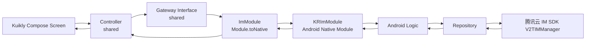
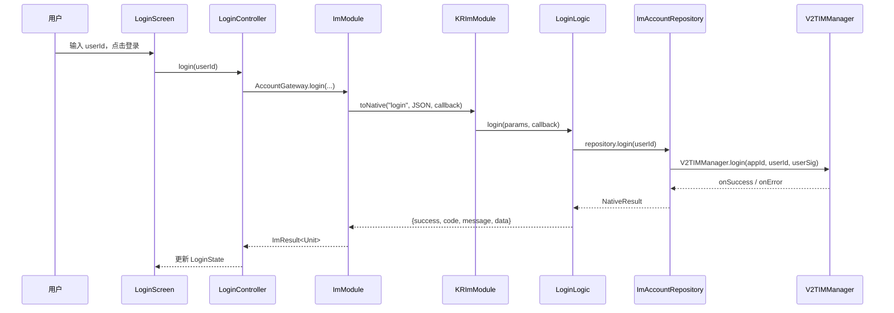
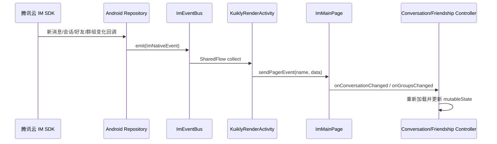
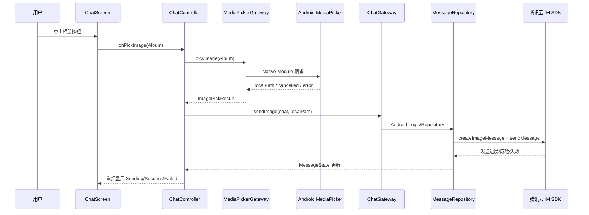

# Kuikly Wally Chat：从 Android Compose 到 Kuikly Compose 的 IM 迁移实践

> 项目地址：[wawo00/KuiklyWallyChat](https://github.com/wawo00/KuiklyWallyChat)  
> 参考来源：[ComposeIM](https://github.com/wawo00/ComposeIM)；早期设计参考了[《用 Jetpack Compose 构建即时通讯 App》](https://juejin.cn/post/6991429231821684773)。  
> ：Android 端已经完成验证；`shared` 以 `commonMain` 承载 Kuikly Compose UI、状态和业务控制器，Android 端承载腾讯云 IM SDK、系统能力与 Kuikly Native Module。


## 0. 实现效果


## 1. 背景与迁移目标

WallyChat 原始版本是传统 Android Compose 应用：页面、ViewModel、Android Activity、腾讯云 IM SDK 都在 Android 模块中。KuiklyWallyChat 的目标不是简单替换 import，而是将**可共享的 UI 与业务状态**沉到 `shared/src/commonMain`，把 Android 专属的 SDK、权限、文件、相册与系统资源保留在 `androidApp`。

最终结构可概括为：

```text
shared/commonMain：Kuikly Compose Screen + Controller + State + Gateway + Bridge 协议
androidApp：Kuikly 宿主、Native Module、Android Logic、Repository、腾讯云 IM SDK
```

这样做的收益是：页面布局、会话/消息/联系人等业务状态不再绑定 Android；未来增加 iOS、Web 或 OHOS 宿主时，可以复用 shared 的绝大多数代码，只补齐对应平台的 Gateway 原生实现。

## 2. Android Compose 与 Kuikly Compose 的主要区别

两者的声明式思想相同：都以 `@Composable` 描述 UI，以状态变化驱动重组，以 `remember` 管理组合期状态。但 Kuikly Compose 运行在 Kuikly 的跨端渲染与页面模型之上，实际迁移时需要注意以下边界。

| 维度 | Android Compose | Kuikly Compose |
| --- | --- | --- |
| 页面入口 | `ComponentActivity.setContent {}` / Navigation | `@Page` + `ComposeContainer.setContent {}` |
| 页面生命周期 | Activity / Fragment / LifecycleOwner | `willInit`、`created`、`pageWillDestroy` 等 Kuikly Pager 生命周期 |
| 业务代码位置 | 通常在 Android module | 适合放在 `shared/commonMain` |
| 平台 API | 可直接使用 `Context`、`Intent`、`Toast`、`Uri` | commonMain 不能 import `android.*`，通过 Module/Gateway 调用原生能力 |
| UI 组件覆盖 | AndroidX Compose 生态完整 | 基础 Compose/Material3 可用，但部分组件尚需自绘或用 `Popup`/`Dialog` 组合 |
| 原生能力 | 直接调用 SDK 或系统服务 | `Module.toNative` → Android `KuiklyRenderBaseModule` |
| 路由 | `NavController` / Activity | 同页可用 Kuikly Navigation；跨 Kuikly 页面通过 `RouterModule` |

当前工程的页面入口就是典型示例：

```kotlin
@Page("imApp", supportInLocal = true)
class ImAppPage : BasePager() {
    override fun willInit() {
        super.willInit()
        setContent {
            val state = loginController.state
            if (state.isLoggedIn) {
                // 登录后由 RouterModule 打开主 Kuikly 页面
            } else if (state.showLoginForm) {
                LoginScreen(
                    state = state,
                    onUserIdChanged = loginController::onUserIdChanged,
                    onLogin = loginController::login,
                )
            } else {
                CircularProgressIndicator()
            }
        }
    }
}
```

这里的 `LoginScreen` 依旧是普通 Composable，因此保留了 Android Compose 中“UI 只接收状态与回调”的优点；差异在于 `LoginController` 不能直接依赖 Android ViewModel 或腾讯云 SDK。

另一个常见差异是组件可用性。例如 Android Compose 中可直接使用 `DropdownMenu`，而 Kuikly 工程更适合采用 `Popup + Card + clickable Row` 自绘菜单；动态图片也不是 Coil Android 的完整用法，而是由 Kuikly `ImageView` 和 Android 侧 `KRImageAdapter` 共同负责。这要求迁移时先检查 Kuikly 当前 API，而不要只复制 Android Compose 的 import。

## 3. shared 与 Android 的交互：Gateway、Module 与 Native Bridge

### 3.1 分层职责

工程将跨端边界拆分为四层：

1. **Controller（shared）**：持有页面状态，响应用户操作，决定加载、刷新、跳转与提示。
2. **Gateway（shared）**：定义业务能力接口，例如登录、加载会话、发送消息；Controller 不知道 SDK 的存在。
3. **ImModule（shared）**：Gateway 的 Kuikly 实现，将 Kotlin 模型编码为 JSON，通过 `toNative` 发送给原生。
4. **KRImModule / Logic / Repository（Android）**：原生 Module 按 method 分发；Logic 解析参数、切协程、组织结果；Repository 封装腾讯云 IM SDK 回调。



共享层的接口只暴露业务模型与 `ImResult`，不泄露 `V2TIMConversation`、`V2TIMMessage` 等 Android SDK 类型：

```kotlin
interface ChatGateway {
    fun loadHistory(
        chat: Chat,
        lastMessage: Message?,
        callback: (ImResult<LoadMessageResult>) -> Unit,
    )

    fun sendText(
        chat: Chat,
        text: String,
        callback: (ImResult<List<Message>>) -> Unit,
    )

    fun sendImage(
        chat: Chat,
        imagePath: String,
        callback: (ImResult<List<Message>>) -> Unit,
    )
}
```

这样的接口是跨端契约。未来 iOS 可以实现同样的 `ChatGateway`，Controller 与 Screen 无需重写。

### 3.2 请求/响应时序

以登录为例，shared 调用 `ImModule`，Android 侧进入 `LoginLogic` 与 `ImAccountRepository`，最终使用 SDK 登录并回传结构化结果：



shared 的实现集中在 `ImModule`：

```kotlin
override fun login(
    userId: String,
    callback: (ImResult<Unit>) -> Unit,
) {
    val params = JSONObject().apply { put("userId", userId) }
    callNative(ImMethod.Login, params) { result ->
        callback(result!!.toImResult { Unit })
    }
}

private fun callNative(
    method: String,
    params: JSONObject,
    callback: CallbackFn,
) {
    toNative(false, method, params.toString(), callback, false)
}
```

Android 原生入口为 `KRImModule`，采用单一 method 路由，所有调用均返回统一的 `success/code/message/data` 协议：

```kotlin
override fun call(
    method: String,
    params: String?,
    callback: KuiklyRenderCallback?,
): Any? = when (method) {
    ImMethod.Login -> LoginLogic.login(params, callback)
    ImMethod.LoadConversations ->
        ConversationLogic.LoadConversations(params, callback)
    ImMethod.SendText -> MessageLogic.sendText(params, callback)
    ImMethod.SendImage -> MessageLogic.sendImage(params, callback)
    else -> callback?.invoke(failure(-404, "未知 IM 方法: $method"))
}
```

### 3.3 主动事件的时序

请求回调适合“我发起一次操作，得到一次结果”；但新消息、会话变更、连接状态变化、UserSig 过期是 SDK 主动通知。工程中 Android 侧以 `ImEventBus` 缓冲事件，由 `KuiklyRenderActivity` 转发到 Kuikly 页面，shared 页面在 `onReceivePagerEvent` 中刷新 Controller。



`ImMainPage` 中已经按事件分发：

```kotlin
when (pagerEvent) {
    ImEvent.ConversationsChanged ->
        conversationController?.onConversationChanged(
            eventData.optString("reason"),
        )

    ImEvent.UnreadCountChanged ->
        conversationController?.onConversationUnReadNum(
            eventData.optLong("totalUnreadCount"),
        )

    ImEvent.FriendsChanged -> friendShipController?.onFriendsChanged()
    ImEvent.GroupsChanged -> friendShipController?.onGroupsChanged()
}
```

## 4. Controller、Logic、Gateway 的设计思路

这三个命名相近，但职责不同，读者可以按照个人习惯命名。

### Controller：页面编排者（shared）

Controller 服务于一个页面或一组紧密相关的 UI。它持有 Compose 可观察状态，接收点击事件，调用 Gateway，完成页面跳转与状态更新。例如 `ConversationController` 加载会话并写入 `ConversationPageViewState`：

```kotlin
class ConversationController(
    navigator: PageNavigator,
    private val gateway: ConversationGateway,
) : BaseController(navigator) {

    var state by mutableStateOf(ConversationPageViewState())
        private set

    override fun start() {
        super.start()
        loadConversations()
    }

    fun onConversationChanged(reason: String?) {
        loadConversations()
    }
}
```

`BaseController` 中使用 `SupervisorJob + Dispatchers.Default` 创建 `controllerScope`，并在 `stop()` 中取消。这避免一个子协程失败取消其他任务，也使页面销毁后不再继续操作 UI。需要注意：涉及 Android SDK、Kuikly 渲染线程或 UI 回调时，应在 Android Logic/Repository 中切到 SDK 要求的线程，不能假设 `Dispatchers.Default` 永远正确。

### Gateway：跨端业务端口（shared）

Gateway 是 Controller 依赖的接口，而不是实现。它的核心价值是**依赖倒置**：页面逻辑依赖“能发送文本消息”这一能力，而非依赖腾讯 SDK。

例如 `ConversationGateway` 定义加载、删除、置顶和全局未读数能力；`FriendshipGateway` 定义好友、已加入群组、加好友和入群能力。Gateway 只传 shared 领域模型，例如 `WallyConversation`、`PersonProfile` 和 `ImResult<T>`。

### Logic：原生适配编排者（Android）

Android Logic 位于 Native Module 与 Repository 中间，不绘制 UI，也不应保存页面状态。它做三件事：解析 JSON 参数、调用 Repository、把 `NativeResult` 转成桥接 JSON。例如：

```kotlin
fun login(params: String?, callback: KuiklyRenderCallback?) {
    val userId = JSONObject(params ?: "{}").optString("userId").trim()
    if (userId.isEmpty()) {
        callback?.invoke(failure(-1, "UserId 不能为空"))
        return
    }

    ImRuntime.AppCoroutineScope.launch {
        when (val result = ImRuntime.accountRepository.login(userId)) {
            is NativeResult.Success -> callback?.invoke(success(emptyMap()))
            is NativeResult.Failure ->
                callback?.invoke(failure(result.code, result.message))
        }
    }
}
```

### Repository：SDK 适配层（Android）

Repository 才是唯一可以直接调用 `V2TIMManager` 的地方。它负责把 SDK 的多回调接口转换为挂起函数/`NativeResult`，并将 `V2TIMMessage`、`V2TIMConversation` 转为 shared 模型。此隔离能显著降低 SDK 更换、回调线程调整和错误码处理对 UI 的影响。


## 5. 资源、文件与图片的读取

资源应按“是否跨端”分类，而不是将所有资源都塞进 Android `res`。

### 5.1 shared 图标与网络图片

跨端静态图标存放在 shared 公共资源/资产体系中，界面用 Kuikly `painterResource` 加载。当前 `Icon` 封装如下：

```kotlin
@Composable
fun Icon(assetName: String, size: Int = 24) {
    Image(
        painter = painterResource(commonDrawable(assetName + ".png")),
        contentDescription = "",
        modifier = Modifier.size(size.dp),
    )
}
```

网络图片使用 Kuikly 的 `rememberAsyncImagePainter`。它最终委托 Android `KRImageAdapter`，所以 GIF、Animated WebP、缓存或鉴权请求等 Android 差异，应该在 Adapter 处理，而不要让 shared UI 依赖 Glide/Coil 的 Android 类型。

### 5.2 Android 字符串和系统资源

Android 专属的 SDK 系统提示、格式化文案可保留在 `androidApp/src/main/res/values/strings.xml`，由 Android 层 `StringResources` 读取：

```kotlin
object StringResources {
    fun getString(resId: Int): String =
        KRApplication.application.getString(resId)

    fun getString(resId: Int, vararg formatArgs: Any): String =
        KRApplication.application.getString(resId, *formatArgs)
}
```

面向用户且需要多端一致的业务文案，应优先沉到 shared；只服务 Android SDK/系统能力的文案放 Android `res` 更合适。

### 5.3 文件选择、相册、下载

`Uri`、运行时权限、相册/相机、MediaStore 都是 Android 能力，shared 不能直接处理。项目采用 `MediaPickerGateway` + `MediaPickerModule` 作为能力边界：

```kotlin
override fun pickImage(
    source: ImagePickSource,
    callback: (ImagePickResult) -> Unit,
) {
    val params = JSONObject().apply {
        put("source", if (source == ImagePickSource.Camera) "camera" else "album")
    }
    callNativeMethod(PICK_IMAGE, params) { result ->
        when (result?.optString("status")) {
            "success" -> callback(ImagePickResult.Success(result.optString("localPath")))
            "cancelled" -> callback(ImagePickResult.Cancelled)
            else -> callback(ImagePickResult.Failure("图片选择失败"))
        }
    }
}
```

Android `KuiklyRenderActivity` 通过 Activity Result API 处理权限和选择结果，再以 `status/localPath/message` 回传。这样聊天 Controller 只接收本地路径，并调用 `ChatGateway.sendImage`，不关心 Matisse、相机权限或 ContentResolver。

## 6. 腾讯云 IM SDK 的功能实现清单

以下能力已由 `KRImModule` 分发，并由 Android Logic/Repository 调用腾讯云 IM SDK；shared Controller 通过 Gateway 驱动 UI。

| 业务 | shared 侧 | Android 侧 |
| --- | --- | --- |
| 登录/自动恢复/登出 | `AccountGateway`、`LoginController` | `LoginLogic`、`ImAccountRepository`、`LoginPreferences` |
| 单聊/群聊进入 | `Chat.C2C`、`Chat.Group`、`ChatController` | `MessageRespository` 根据 chat 类型调用对应 SDK API |
| 会话列表/删除/置顶 | `ConversationGateway`、`ConversationController` | `ConversationLogic`、`ConversationRespository` |
| 未读数清理 | `ChatGateway.cleanUnread` | `MessageLogic`/消息管理器 |
| 联系人与已加入群组 | `FriendshipGateway`、`FriendShipController` | `FriendshipLogic`、`FriendshipRepository`、`GroupRepository` |
| 好友详情、加好友、备注、删除好友 | `FriendProfileGateway`、`FriendProfileController` | `FriendProfileLogic` 与好友 Repository |
| 群详情、成员、入群、退群 | `GroupProfileGateway`、`FriendshipGateway` | `GroupLogic`、`GroupRepository` |
| 历史消息 | `ChatGateway.loadHistory` | `MessageLogic`、`MessageRespository` |
| 文本/图片发送 | `sendText`、`sendImage` | `MessageLogic` 创建/发送 V2TIMMessage，Repository 转模型 |
| 图片选取/预览/下载 | `MediaPickerGateway`、`DownLoadGateway` | 原生图片选择、下载 Module、MediaStore |

以“入群”操作为例，Controller 收到成功回调后应刷新群组和联系人状态：

```kotlin
gateway.joinGroup(ids[index]) { result ->
    dismissAddSheet()
    hideLoading()
    when (result) {
        is ImResult.Success -> {
            "操作成功".Toast()
            loadJoinedGroups()
            loadFriends()
        }
        is ImResult.Failure -> result.message.orEmpty().ifBlank {
            "入群失败"
        }.Toast()
    }
}
```

消息发送则应采用“先插入 Sending 本地消息，再用 SDK 结果更新为 Success/Failed”的体验，避免网络请求期间用户看不到消息。`ChatController` 已按 `MessageState.Sending`、`Success`、`Failed` 更新本地消息列表；失败时保留失败态并提示原因，便于后续实现重试。

安全上需要特别强调：开发环境可以使用本地 `GenerateUserSig` 辅助调试，但生产环境绝不能将腾讯云 IM 的 SecretKey 打包进 APK。正式 UserSig 必须由业务服务端签发；已有密钥一旦进入源码或历史提交，应在控制台轮换。

## 7. 已知问题与后续修复建议

### 7.1 全局未读数显示不稳定

底部导航栏会读取 `conversationState.unReadTotalNum`：

```kotlin
unreadCount = if (index == 0) {
    conversationState.unReadTotalNum.toInt()
} else {
    0
}
```

当前问题是全局未读数在部分消息/页面切换场景下显示不正确。事件链路依赖 Android `ImEventBus`、Activity 转发和 `ImEvent.UnreadCountChanged`，任一环节的订阅时机、事件丢失或未及时重新查询都可能导致 UI 与 SDK 状态不一致。

### 7.2 入群后联系人/群组列表刷新不稳定

`FriendShipController.onJoinGroup` 已在成功后调用 `loadJoinedGroups()` 与 `loadFriends()`，并且原生侧也有 `GroupsChanged`、`FriendsChanged` 事件设计。但当前仍存在部分路径下列表未刷新或刷新后状态滞后的问题。


### 7.3 主题切换尚未完整落地

工程已定义 `AppThemeMode.Light/Dark/Gray`，并有 `WallyChatTheme`、`AppColorScheme` 等基础。但是当前默认参数仍为 `Light`，没有完整的“设置入口 → 持久化 → 根 Composition 状态 → 所有页面重组”闭环；灰度主题的绘制也保留为注释/TODO。

## 8. 总结：可复用的方法论

本项目的核心不是“把 Android Compose 页面搬到 Kuikly”，而是把 IM 应用拆为稳定的跨端业务层与可替换的平台实现层：

- Screen 保持纯声明式，接收 `State + Event`；
- Controller 管理页面状态与用户流程；
- Gateway 表达业务能力，不暴露平台 SDK；
- ImModule/KRImModule 形成明确、可测试的 JSON 协议边界；
- Android Logic/Repository 承担 SDK 回调、线程和系统能力；
- SDK 主动事件与单次请求回调分别建模；
- 资源、文件、权限与图片解码按“共享还是平台专属”划分。

遵循这套边界后，新增“语音消息”“文件消息”“群公告”“黑名单”等能力时，不需要从 UI 直接钻到 Android SDK：只需补充领域模型、Gateway 方法、桥接协议、Android 实现和 Controller 交互。它既降低了 Kuikly 学习期的复杂度，也为后续跨端扩展保留了清晰空间。

## 9. 一次功能迁移的推荐流程：以“发送图片消息”为例

从 Android Compose 迁到 Kuikly 时，最容易犯的错误是：先把原来的 `ViewModel`、`ActivityResultLauncher`、图片选择和 SDK 调用一起搬进 shared。这会让 shared 迅速重新依赖 Android，跨端边界也失去意义。更可靠的做法是按能力自顶向下拆解：先确定 UI 需要什么状态和事件，再建立跨端契约，最后补 Android 实现。

“发送图片消息”可以分成三个独立能力：选择图片、准备图片文件、将图片消息发给指定会话。选择相册/相机是系统能力，文件压缩和 `content://` 转本地文件也是 Android 能力；发送图片是 IM 业务能力。shared 只需要看到如下结果：用户取消、选择失败，或成功得到一个可读的本地路径。



推荐实现顺序如下：

1. 在 shared 先定义 `ImagePickSource`、`ImagePickResult`、`MediaPickerGateway`，以及 `ChatGateway.sendImage(chat, imagePath)`；
2. 在 `ChatController` 编写“选择成功后开始发送、取消后不提示、失败后 Toast”的纯业务流程；
3. 在 `MediaPickerModule` 中把 shared 结构转换为 JSON；
4. Android 侧由 `KRMediaPickerModule` 和 `KuiklyRenderActivity` 处理权限、Activity Result、相册/相机；
5. Android 文件准备器负责把 Uri 转为临时文件，必要时压缩，绝不能把 Android Uri 类型传过桥；
6. `MessageRespository` 调 SDK 发送图片，并将 SDK 消息转换回 shared 的 `ImageMessage`；
7. 最后再做页面级测试：取消、无权限、图片过大、网络失败、重复点击、页面退出后回调等。

此流程的优点是每一层都可单独替换。例如未来 iOS 只需实现 iOS 图片选择器与 IM SDK Repository；`ChatScreen` 和 `ChatController` 无需理解 Photos framework。

## 10. 状态、协程与页面生命周期：不要让异步任务逃离页面

声明式 UI 的稳定性很大程度上取决于异步任务是否受生命周期控制。原 Android Compose 中，通常用 `viewModelScope` 管理页面请求；在当前 Kuikly shared 架构中，Controller 不是 Android ViewModel，因此项目的 `BaseController` 使用自己的 `SupervisorJob` 和 `CoroutineScope`：

```kotlin
open class BaseController(var navigator: PageNavigator?) {
    private val controllerJob = SupervisorJob()

    protected val controllerScope = CoroutineScope(
        controllerJob + Dispatchers.Default,
    )

    open fun stop() {
        navigator = null
        controllerScope.cancel()
    }
}
```

这里有三个关键点。

**第一，`SupervisorJob` 适合页面内并发任务。** 会话列表请求失败不应取消好友列表请求；某个图片上传失败也不应令消息监听停止。它和普通 `Job` 的区别是子任务失败不会向上取消同级任务。对于“同一个业务必须全成或全败”的事务才需要普通父 Job 或显式的 `coroutineScope`。

**第二，Controller 的 scope 只能服务于页面业务，不能代替 Android 主线程。** `Dispatchers.Default` 更适合轻量计算、模型转换或调度；腾讯 SDK 若要求主线程，必须在 Android Repository/Logic 中用 `withContext(Dispatchers.Main.immediate)` 调用。shared 不应猜测不同平台 SDK 的线程约束。当前工程的 `ImRuntime.AppCoroutineScope` 使用 `SupervisorJob() + Dispatchers.Main.immediate`，正是为了给 Android SDK 入口提供受控的主线程执行环境。

**第三，创建与销毁要成对。** `ImMainPage.created()` 创建并启动 `MainPageController`、`ConversationController`、`FriendShipController`；`pageWillDestroy()` 中依次调用 `stop()`。如果忘记 stop，旧页面的网络回调仍可能修改旧 state、继续跳转，甚至间接持有 navigator。反之，如果 Controller 被复用，则 `stop()` 后不能继续使用原 scope，应该重建 Controller 或重新创建 scope。

推荐的状态流向是单向的：

```text
用户事件 → Controller 方法 → Gateway 异步结果 → 新 State(copy) → Screen 重组
```

不要在 Screen 中直接修改复杂业务数据，也不要把可变列表暴露给多个 Composable。比如会话列表应通过 `state = state.copy(conversationList = result.data)` 一次性替换；消息发送状态则根据 `msgId` 定位并生成新的消息对象。这样能避免“列表内容变了但没有触发重组”“旧回调覆盖新数据”的问题。

针对旧请求覆盖新请求，建议在后续迭代中引入以下机制：

- 为 `loadConversations`、`loadFriends`、`loadJoinedGroups` 保存 Job，发起新刷新时取消旧 Job；
- 或维护一个递增 `requestVersion`，只接收最新版本的回调；
- 对 IM 事件做 200～500ms 去抖，合并连续的会话变化事件；
- 页面退出后先检查 Controller 是否仍 active，再更新 state；
- 对发送消息使用稳定的本地 `msgId`，避免同一条消息因事件顺序不同被重复插入。

## 11. JSON 桥接协议如何设计，才能长期维护

Kuikly Native Module 是跨层通信边界，不能把它当成“随手传几个 Map”的工具。协议一旦增长，缺少约束会直接导致 Android 与 shared 难以排查的不兼容问题。当前工程已经把 method、params、结果编解码集中到 `ImMethod`、`ImParams`、`ImResult`、`ImJsonCodec`，这个方向应继续坚持。

建议所有同步/异步响应都遵循同一个外壳：

```json
{
  "success": true,
  "code": 0,
  "message": "",
  "data": {
    "items": []
  }
}
```

失败也必须返回同样结构：

```json
{
  "success": false,
  "code": 70001,
  "message": "UserSig 已过期",
  "data": {}
}
```

不要让某些 method 返回字符串、另一些返回 `null`、还有一些抛异常。shared 侧统一转为：

```kotlin
sealed interface ImResult<out T> {
    data class Success<T>(val data: T) : ImResult<T>
    data class Failure(val code: Int, val message: String) : ImResult<Nothing>
}
```

这样 Controller 能显式处理成功与失败，不需要依赖“空列表到底代表成功还是失败”的约定。

对于模型字段，建议遵循以下规则：

- shared 使用稳定的业务字段名，例如 `id`、`avatarUrl`、`unreadMessageCount`，不暴露 `V2TIM` 的类名和常量；
- Android Converter 负责 SDK 字段到 shared 字段的单向映射；
- 新字段优先采用可选字段与默认值，保证旧 shared/旧原生端混合升级时不会立刻崩溃；
- 参数校验放在 Android Logic 的入口，错误码与错误文案保留足够上下文；
- 数据量大的历史消息应分页，不能一次通过 JSON 传输全部本地记录；
- 日志中不要打印 UserSig、Secret、完整私聊内容或用户敏感文件路径。

建议为 `ImJsonCodec` 保留 commonTest。当前工程已有 `ImJsonCodecTest`，后续应至少覆盖：文本消息、图片消息、C2C 会话、群会话、空数组、缺字段、未知消息类型和错误响应。协议测试的价值很高：它无需启动模拟器，也能在 SDK 升级前发现字段映射回归。

## 12. IM 事件处理：请求结果与订阅事件不能混为一谈

聊天业务中存在两类异步来源：一类是用户主动点击后得到的请求结果，例如“删除会话成功”；另一类是 SDK 随时到来的推送，例如“收到新消息”“对方撤回消息”“群成员变化”。两者不能用同一种机制硬套。

- **请求/回调**：有明确的发起者、参数和一次性结果，适合 `Gateway(callback)` 或挂起函数；
- **主动事件**：没有固定的请求发起者，可能发生在任意页面，适合 EventBus/Flow → Kuikly Pager Event → Controller 刷新。

Android Repository 应尽早注册腾讯云监听器，例如会话 Repository 的 `V2TIMConversationListener`、消息 Repository 的 `V2TIMAdvancedMsgListener`、群组和好友监听器。监听器收到事件后不应直接持有 Activity 或操作某个 Compose Screen，而是只向 `ImEventBus` 发出业务事件：

```kotlin
eventBus.emit(
    ImEvent.ConversationsChanged,
    mapOf("reason" to "onConversationChanged"),
)
```

这样 Activity 重建、页面切换、多个 Kuikly 页面并存时不会因 Repository 持有旧 UI 而内存泄漏。Kuikly 宿主可以根据当前页面把事件转发为 Pager Event；页面再决定是否刷新自身 Controller。

事件系统仍需处理三个边界：

1. **无订阅者的事件。** `MutableSharedFlow(extraBufferCapacity = 32)` 只能临时缓冲，不能代替状态存储。总未读数、连接状态应同时保留最近快照，页面创建时主动读取。
2. **事件风暴。** 新消息到来可能同时触发会话变化、未读变化、消息变化。应合并刷新，避免每个事件都全量拉取会话和好友列表。
3. **页面可见性。** 当前聊天页已经加载了该会话的消息时，收到该会话的新消息应该追加到消息列表并标记已读；会话页则刷新排序和未读数。不要让所有页面都无差别拉取全部数据。

## 13. 导航、页面参数与可复用 UI 的边界

Kuikly 应区分两层导航：同一个 Compose `NavHost` 内的 route 返回使用 `navController.popBackStack()`；独立 Kuikly `@Page` 则通过 `RouterModule` 打开/关闭。当前工程将主页面、聊天页、好友资料、群资料、图片预览拆为页面，更适合原生路由和页面数据传递。

建议传给页面的仅是轻量且可序列化的数据，例如 `userId`、`groupId`、`chatId`、图片 URL 列表和初始索引。不要把 Controller、SDK 会话对象或 Android Context 放进 `pageData`。目标页应根据 id 通过 Gateway 重新加载详情，这样页面可独立恢复，也避免对象跨桥失效。

可复用 Composable 不应直接获取 RouterModule 或 Gateway。例如操作菜单更好的签名是：

```kotlin
@Composable
fun MoreActionMenu(
    expanded: Boolean,
    onDismiss: () -> Unit,
    onDelete: () -> Unit,
    onPin: () -> Unit,
)
```

Screen/Controller 的上层再将 `onDelete`、`onPin` 连接到真实业务。这样菜单可以预览、测试，并且不会因任何页面路由变化而修改。

## 14. 质量保障、日志与排障清单

跨端桥接的排障成本通常高于单端应用，应在开发阶段建立最小可观测性。建议每条请求生成 `requestId`，并在 shared Module、Android KRImModule、Logic、Repository 中打印同一 requestId；日志需包含 method、耗时、成功状态、错误码，但不得包含 UserSig 和敏感正文。

排查顺序可以固定为：

1. UI 是否真的触发了 Controller 方法；
2. Gateway 是否将正确 JSON 发送给 `ImModule.toNative`；
3. Android `KRImModule` 是否匹配到正确 method；
4. Logic 是否校验参数并启动协程；
5. Repository 是否真正调用 SDK，以及回调线程/错误码是什么；
6. 是否向 callback 返回统一结果；
7. shared 是否正确 decode 并在有效生命周期内更新 state；
8. 若是主动事件，检查 EventBus 订阅数、宿主转发和 `onReceivePagerEvent`。

测试建议分层进行：

| 层级 | 建议测试 |
| --- | --- |
| shared 模型/Codec | JSON 编解码、错误响应、消息与会话转换 |
| Controller | 登录成功/失败、会话删除、置顶、发送失败、入群后的刷新 |
| Android Repository | SDK 回调转挂起结果、错误码映射、分页边界 |
| Bridge | method 分发、参数缺失、返回结构一致性 |
| UI 冒烟 | 登录、C2C/群聊进入、文本/图片发送、退群、断网重连、横竖屏或页面重建 |

提交前还应做以下人工检查：确认没有提交 `TIM_SECRET_KEY`、真实 UserSig、用户头像私有链接、设备绝对路径或调试账号；确认 Android 权限在拒绝时有明确回调；确认页面销毁时 listener/Job 不会继续更新 UI；确认低网络条件下 Loading 和失败态不会让用户无法返回。

## 15. 后续跨端演进建议

当前 README 已明确 Android 是已验证端，iOS、Web、OHOS 是保留模块。后续跨端时，不建议先追求所有功能一次性完全对齐，而应按“协议与业务优先、平台体验逐步补齐”的顺序推进：

1. 先复用 `shared` 的模型、Gateway、Controller、Screen 和 JSON 协议；
2. 新平台实现 Account、Conversation、Message、Friendship、Group 五个核心 Gateway；
3. 优先完成登录、会话、文本消息和历史消息；
4. 再实现图片选择、下载、推送、文件消息等强平台能力；
5. 为不同平台保留同一业务错误码，但允许展示不同的系统权限文案；
6. 将平台差异封装为 `expect/actual` 或 Module，不在 Screen 中散落 `if (Android)` 分支。

需要特别注意，腾讯云 IM SDK 的能力、回调线程、媒体文件路径和权限模型在不同端并不相同。可复用的是业务契约和状态机，而不是直接复用 Android SDK 调用代码。只要 Gateway 协议稳定，新增平台的改动就集中在原生实现，而不会破坏聊天 UI 的整体结构。

## 16. 分享结语

KuiklyWallyChat 的实践证明：将 Android Compose 项目迁移到 Kuikly，关键不在于掌握多少 UI API，而在于把边界划清。UI 用 Compose 描述，Controller 管页面流程，Gateway 定义业务端口，Module 负责跨端协议，Android Logic/Repository 处理 SDK 与系统能力。这个结构让现有 Android 功能可验证、可排障，也让之后的多端接入有可持续的演进路径。

当团队新增任何需求时，都可以先问四个问题：它是 shared 的页面状态还是平台能力？它属于一次性请求还是主动事件？它应该以哪种领域模型跨边界？页面退出后谁负责取消它？只要这四个问题能回答清楚，绝大多数 Kuikly 迁移问题都会变得可拆解、可测试、可维护。
