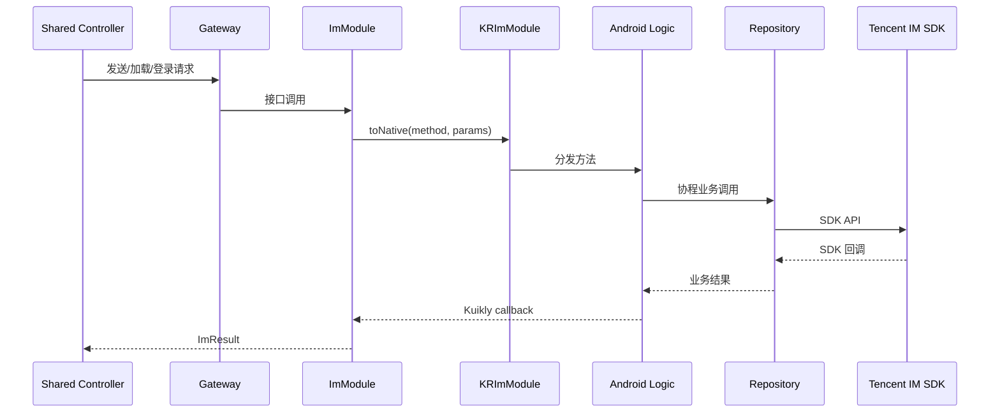
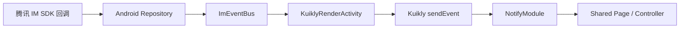

# Kuikly Wally Chat

基于 **腾讯云 IM SDK** 与 **Kuikly Compose** 实现的聊天应用示例。目前已完成并验证 **Android 端**；`shared` 模块将页面 UI、状态和业务控制器放在 `commonMain`，Android 端负责腾讯 IM SDK、系统能力及 Kuikly 原生桥接。

> 本项目用于学习和验证 Kuikly Compose 与腾讯云 IM SDK 的集成方式，不应将 UserSig 生成密钥或任何生产凭证打包进客户端。

## 功能

- **账号与会话**：用户登录、自动登录恢复、登录状态与用户标识本地持久化。
- **会话**：会话列表、未读数清理、单聊与群聊入口。
- **联系人与群组**：好友列表、已加入群组、好友详情与群组详情。
- **消息**：文本消息、图片消息、消息历史加载、实时消息通知与发送状态更新。
- **图片能力**：相册/相机选图、图片预览、图片下载并保存至系统相册。
- **界面体验**：Kuikly Compose 声明式 UI；部分加载、标题栏等组件使用 Compose 动画。

## 技术栈

| 范畴 | 技术 |
| --- | --- |
| UI | Kuikly Compose、Kotlin Compose Runtime |
| 共享代码 | Kotlin Multiplatform（主要位于 `shared/src/commonMain`） |
| Android | Kotlin、AndroidX、AppCompat、协程 |
| 即时通信 | 腾讯云 IM SDK（`com.tencent.imsdk:imsdk-plus`） |
| 图片 | Matisse、Coil、Glide、Android MediaStore |
| 构建 | Gradle、Android Gradle Plugin、KSP |

## 架构

项目遵循“共享 UI/业务控制 + Android 原生实现”的分层方式：

- **页面与 UI**：Kuikly `ComposeContainer` 页面及 Compose Screen 位于 `shared/commonMain`。
- **Controller**：维护页面 ViewState、页面路由、消息列表与用户交互流程。
- **Gateway**：共享层定义 IM、联系人、会话、图片选择等能力接口，隔离页面业务与平台实现。
- **Bridge**：`ImModule` 把共享层请求转换为 Kuikly 原生调用；Android `KRImModule` 分发到具体 Logic。
- **Android IM 层**：Repository 包装腾讯 IM SDK 的回调，Logic 处理参数、协程与桥接返回；`ImRuntime` 负责初始化和依赖装配。

### 请求/响应链路



### 原生事件回推链路

腾讯 IM 的登录状态、消息和会话变化并不依赖某次请求的 callback，而是通过事件总线回推到 Kuikly 页面：



## 目录说明

```text
.
├─ androidApp/                         # 当前已实现的 Android 容器与原生能力
│  └─ src/main/java/.../
│     ├─ im/                            # 腾讯 IM 初始化、Repository、Logic、事件
│     ├─ im/bridge/KRImModule.kt        # IM 原生桥接入口
│     ├─ module/                         # 图片选择、下载、分享等原生 Module
│     └─ KuiklyRenderActivity.kt         # Kuikly 渲染容器与系统权限处理
├─ shared/
│  └─ src/commonMain/kotlin/.../
│     ├─ chat/base/                      # 领域模型
│     ├─ chat/im/                        # Gateway、ImModule、JSON 编解码、事件定义
│     ├─ chat/ui/                        # Compose Screen、Controller、页面状态
│     ├─ ImAppPage.kt                    # 应用入口页
│     ├─ ImMainPage.kt                   # 主页面
│     └─ ImChatPage.kt                   # 聊天详情页
├─ h5App/                               # 工程保留模块，未作为已交付端说明
├─ iosApp/                              # 工程保留模块，未作为已交付端说明
└─ ohosApp/                             # 工程保留模块，未作为已交付端说明
```

## 关键实现

### 账号与自动登录

Android `KRApplication` 启动后初始化本地登录存储和 `ImRuntime`。`ImAccountRepository` 负责腾讯 IM SDK 初始化、登录、登出及登录会话恢复；共享层通过 `AccountGateway` 和 `LoginController` 驱动页面状态。

### 单聊、群聊与消息

共享模型以 `Chat.C2C` 和 `Chat.Group` 区分单聊和群聊。`ChatController` 通过 `ChatGateway` 发起历史消息加载、发送文本/图片和清除未读数；Android `MessageRespository` 调用腾讯 IM SDK 的单聊或群聊 API 并转换为共享层消息模型。

### Kuikly 与 Android 通信

共享层的 `ImModule` 负责将 `Gateway` 调用编码为原生参数，Android `KRImModule` 按方法名路由至 `LoginLogic`、`MessageLogic`、`FriendshipLogic` 等实现，再把结果通过 `KuiklyRenderCallback` 返回。对于 SDK 主动事件，Android 通过 `ImEventBus` 和 `KuiklyRenderActivity` 将事件发送回共享层订阅者。

### 图片选择、预览与下载

共享层通过 `MediaPickerGateway` 和下载 Module 请求系统能力。Android 层负责相机/相册权限、图片选择、下载权限以及使用 `MediaStore` 保存图片；聊天页支持图片消息发送与预览页下载。

## 环境要求

- Android Studio（建议使用当前稳定版本）
- JDK 17 或与 Android Gradle Plugin 兼容的 JDK
- Android SDK Platform 36（项目 `androidApp` 使用 `compileSdk = 36`）
- Android 设备或模拟器（项目 `minSdk = 28`）
- 可访问腾讯云 IM 服务的网络环境

## 运行 Android 应用

1. 使用 Android Studio 打开项目根目录，等待 Gradle Sync 完成。
2. 配置 Android SDK 路径：在本机 `local.properties` 中设置 `sdk.dir`（该文件不应提交）。
3. 按下述“腾讯云 IM 配置”完成 App ID 与 UserSig 接入。
4. 连接设备或启动模拟器后运行 `androidApp`。

也可以在项目根目录执行：

```powershell
.\gradlew.bat :androidApp:assembleDebug
.\gradlew.bat :androidApp:installDebug
```

## 腾讯云 IM 配置

应用依赖腾讯云 IM 的 SDK 初始化、用户登录与消息服务。请按以下原则接入自己的环境：

1. 在腾讯云控制台创建 IM 应用，获取 **SDKAppID**。
2. 使用你的业务服务端为已认证用户签发短期 **UserSig**。
3. 在 Android 的 `UserSigProvider` 实现中接入服务端获取逻辑，并由 `ImRuntime` 装配该 Provider。
4. 不要把 UserSig 计算密钥、服务端 API Secret、长期 Token 或生产账号写入源码、`local.properties`、截图或 Git 历史。

> **安全提示**：UserSig 的安全生成应在受控服务端进行。客户端只应获取短期、受限的 UserSig；泄露计算密钥会使任何人能够伪造用户身份登录 IM。

## 截图

当前仓库未维护可公开分发的产品截图。欢迎在不包含账号、会话内容、UserSig 或其他敏感信息的前提下，将截图放入 `docs/images/` 并在此处引用。

## 已知限制

- 当前只保证 Android 端实现；目录中存在的 iOS、H5、鸿蒙或小程序相关模块不代表已完成适配或可交付。
- 腾讯 IM 的服务端鉴权、账号体系和生产环境 UserSig 服务需要由接入方自行部署与维护。
- 测试目前以共享层的局部单元测试为主，尚未建立完整的设备端 UI 测试与端到端 IM 联调测试体系。
- Kuikly Compose 与官方 Jetpack Compose 的组件/API 并非完全一致，开发共享 UI 时应遵循项目的 `AGENTS.md` 约束。

## 后续计划

- [ ] 完善 iOS、H5、鸿蒙等端的适配与验证。
- [ ] 增加端到端登录、消息发送、图片下载的自动化测试。
- [ ] 完善离线缓存、错误恢复与网络状态提示。
- [ ] 扩展消息类型、会话管理和群组管理能力。
- [ ] 补充脱敏的功能截图、演示视频和发布说明。

## 贡献

欢迎提交 Issue 或 Pull Request。提交前请确保：

1. 不提交任何密钥、UserSig、真实账号、聊天记录或设备路径。
2. 修改共享 UI 时遵守根目录 `AGENTS.md` 中的 Kuikly Compose 导入与 API 约束。
3. 至少执行与改动相关的 Gradle 编译或测试任务。
4. 保持改动聚焦，并说明验证结果。

## 许可证

当前仓库尚未包含 `LICENSE` 文件。使用、分发或二次开发前，请先由仓库维护者补充并确认许可证条款。